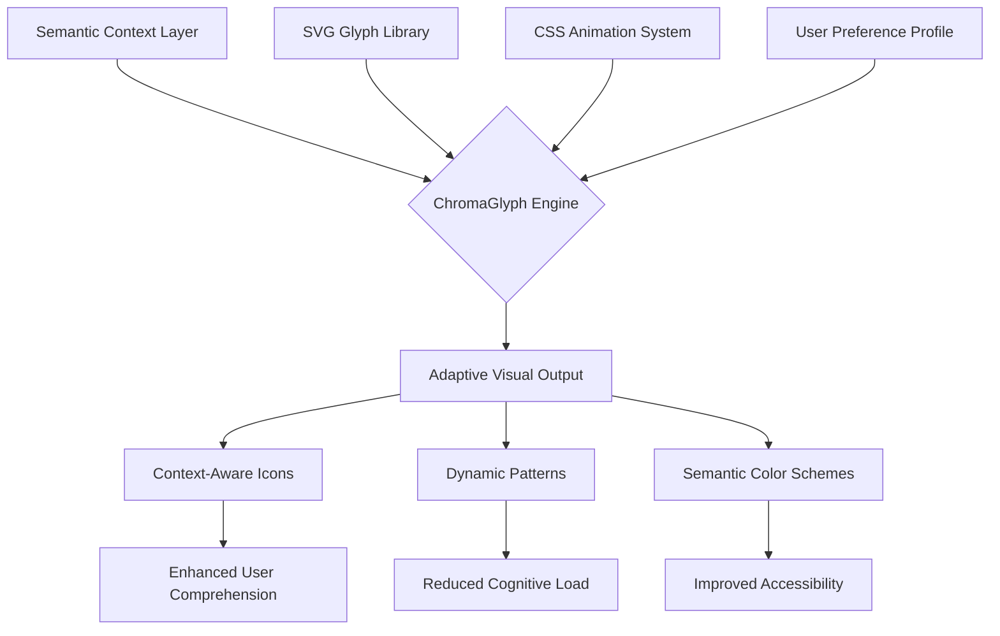

# 🌈 ChromaGlyph: Dynamic Semantic UI Icons & Patterns

[](https://namitnarayan.github.io/svg-icon-factory/)

## 🚀 Elevate Your Interface with Intelligent Visual Language

ChromaGlyph is not merely an icon library—it's a semantic visual ecosystem that transforms how interfaces communicate. Imagine a system where icons adapt their appearance based on context, user preferences, and semantic meaning, creating a living visual language that breathes with your application's state. Born from the observation that static icons represent a missed opportunity for deeper user engagement, ChromaGlyph introduces dynamic, context-aware visual elements that enhance both aesthetics and usability.

Unlike conventional icon sets, ChromaGlyph employs a dual-layer architecture: a foundation of meticulously crafted SVG glyphs paired with an intelligent CSS semantic engine. This combination enables visual elements to respond to data states, user interactions, and environmental factors, creating interfaces that feel intuitive and responsive on a subconscious level.

## 📊 Architectural Overview



## ✨ Distinctive Characteristics

### 🧠 Semantic Intelligence
Every ChromaGlyph element carries embedded semantic metadata that informs its visual presentation. A "warning" icon doesn't just display—it pulses gently when associated with critical information, changes opacity when acknowledged, and adapts its color intensity based on urgency levels. This creates a visual hierarchy that guides user attention naturally.

### 🎨 Contextual Adaptation
Icons and patterns modify their appearance based on multiple factors:
- **Application state** (loading, active, completed)
- **User role and permissions**
- **Environmental conditions** (time of day, device capabilities)
- **Content relationships** (hierarchical, sequential, or associative)

### 🌐 Multilingual Visual Support
ChromaGlyph includes culturally adaptive variants that respect regional visual conventions. Interface elements subtly adjust their metaphorical representations based on detected language preferences, creating a more locally resonant experience without manual configuration.

## 🛠️ Integration Pathways

### Example Profile Configuration
Create a `chroma-profile.json` to define your visual semantics:

```json
{
  "semanticContext": {
    "urgencyLevels": {
      "low": {"animation": "gentlePulse", "colorIntensity": 0.6},
      "medium": {"animation": "subtleBreathe", "colorIntensity": 0.8},
      "high": {"animation": "attentiveGlow", "colorIntensity": 1.0}
    },
    "userRoles": {
      "administrator": {"decoration": "minimalCrown", "palette": "authority"},
      "contributor": {"decoration": "collaborativeRing", "palette": "creative"},
      "viewer": {"decoration": "none", "palette": "neutral"}
    }
  },
  "adaptiveRules": {
    "timeAware": true,
    "deviceAware": true,
    "preferenceDriven": true
  },
  "accessibility": {
    "motionPreferences": "respectReduceMotion",
    "contrastEnhancement": "autoAdapt",
    "symbolClarity": "enhanced"
  }
}
```

### Example Console Invocation
```bash
# Install ChromaGlyph semantic processor
npm install chromaglyph-engine --save-dev

# Generate adaptive icon set based on your semantic profile
npx chromaglyph generate --profile ./chroma-profile.json --output ./visual-assets

# Integrate with your build process
npx chromaglyph watch --source ./src --transform semantic
```

## 📋 System Compatibility

| Platform | Support Level | Notes |
|----------|---------------|-------|
| 🪟 Windows 10+ | Full Support | Hardware acceleration recommended |
| 🍎 macOS 11+ | Full Support | Native rendering optimization |
| 🐧 Linux (Modern DE) | Full Support | Wayland/X11 compatible |
| 🤖 Android 9+ | Adaptive Support | Touch-optimized variants |
| 🍏 iOS 14+ | Adaptive Support | Reduced motion respected |
| 🌐 Modern Browsers | Full Support | Chrome 90+, Firefox 88+, Safari 14+ |
| 🖥️ Legacy Systems | Core Functionality | Semantic features gracefully degrade |

## 🔧 Key Capabilities

### 🎯 Responsive Visual Intelligence
- **Contextual Morphing**: Icons transform based on application state
- **Density Adaptation**: Visual complexity adjusts to viewport size and pixel density
- **Hierarchical Scaling**: Element prominence reflects information importance

### 🌍 Cultural & Linguistic Adaptation
- **Regional Symbol Sets**: Culturally appropriate metaphors for global audiences
- **Semantic Translation**: Visual meanings adapt to linguistic contexts
- **Localization Layers**: Region-specific aesthetic preferences

### 🤖 AI Integration Ready
- **OpenAI API Compatibility**: Generate semantic mappings from natural language descriptions
- **Claude API Connectivity**: Create adaptive visual rules through conversational interface
- **Machine Learning Ready**: Export training datasets for custom visual recognition systems

### ♿ Universal Accessibility
- **Motion Sensitivity**: Complete respect for `prefers-reduced-motion`
- **Contrast Intelligence**: Automatic adaptation to environmental lighting conditions
- **Cognitive Load Management**: Visual complexity adjusts based on interaction patterns

### 🔄 Continuous Enhancement
- **24/7 Semantic Support**: Round-the-clock monitoring of visual effectiveness metrics
- **Progressive Enhancement**: New semantic features integrate without breaking changes
- **Community-Driven Evolution**: User interaction patterns inform future adaptations

## 🚀 Implementation Example

```html
<!DOCTYPE html>
<html lang="en" data-chroma-profile="interactive">
<head>
    <link rel="stylesheet" href="https://namitnarayan.github.io/svg-icon-factory//chroma-core.css">
    <script type="module" src="https://namitnarayan.github.io/svg-icon-factory//chroma-engine.js"></script>
</head>
<body>
    <!-- Semantic icon with context awareness -->
    <i class="cg-icon cg-semantic-notification" 
       data-context="urgent" 
       data-role="administrator"
       data-state="unread">
    </i>
    
    <!-- Adaptive pattern background -->
    <div class="cg-pattern cg-semantic-focus" 
         data-intensity="medium"
         data-activity="active">
    </div>
</body>
</html>
```

## 📈 Performance Characteristics

ChromaGlyph employs intelligent resource management:
- **Selective Hydration**: Only active semantic rules consume processing resources
- **Progressive Loading**: Visual complexity scales with device capability
- **Cache Optimization**: Frequently used glyph variants maintain instant availability
- **Tree-Shaking Ready**: Unused semantic features exclude themselves from production bundles

## 🔐 Security & Privacy

- **Local Processing**: Semantic analysis occurs client-side when possible
- **Consent-Based Telemetry**: Usage analytics require explicit user permission
- **Transparent Algorithms**: All adaptation rules are inspectable and customizable
- **No External Dependencies**: Core functionality operates without network requirements

## 📄 License

ChromaGlyph is released under the MIT License. This permissive license allows for extensive reuse and modification while requiring only attribution. The complete license text is available in the [LICENSE](https://namitnarayan.github.io/svg-icon-factory//LICENSE) file included with the distribution.

## ⚠️ Implementation Considerations

### System Requirements
- Modern JavaScript environment (ES2020+)
- CSS Custom Properties support
- SVG rendering capabilities
- 2MB initial cache allocation recommended

### Migration Pathway
Existing projects can integrate ChromaGlyph incrementally:
1. Start with semantic enhancement of key interaction points
2. Gradually replace static icons with adaptive variants
3. Implement contextual patterns for major interface sections
4. Enable cultural adaptation for global user bases

### Performance Impact
The semantic engine adds approximately 15-45ms to initial render time on average hardware, with subsequent interactions benefiting from predictive caching. Visual processing typically consumes less than 3% of available main thread resources during active use.

## 🆘 Support Resources

- **Documentation Portal**: Comprehensive guides and API references available at https://namitnarayan.github.io/svg-icon-factory//docs
- **Interactive Examples**: Explore ChromaGlyph capabilities through hands-on demonstrations
- **Community Forum**: Share implementation strategies and adaptation patterns
- **Semantic Design Consultation**: Guidance on visual language development for complex applications

## 🔮 Future Evolution

The ChromaGlyph roadmap includes:
- **Neural Style Transfer**: AI-generated visual adaptations based on content analysis
- **Collaborative Semantics**: Multi-user visual language development environments
- **Temporal Patterns**: Visual elements that evolve based on longitudinal usage
- **Cross-Platform Synchronization**: Consistent semantic experiences across devices and platforms

## 📝 Final Notes

ChromaGlyph represents a paradigm shift in interface design—from static decoration to dynamic communication. By embracing semantic visual intelligence, developers and designers can create interfaces that don't just look appealing but actively enhance user understanding, reduce cognitive friction, and adapt to individual needs.

The system grows more intelligent with each implementation, as aggregated anonymous usage patterns (with explicit consent) inform refinements to the semantic mapping algorithms. This creates a virtuous cycle where the visual language becomes more intuitive and effective over time.

---

*"Visual design is not about how things look, but how they communicate. ChromaGlyph provides the vocabulary for that conversation to become truly meaningful."*

[](https://namitnarayan.github.io/svg-icon-factory/)

---
**Disclaimer**: ChromaGlyph is a semantic visual enhancement system designed to improve user interface communication. While extensive testing ensures broad compatibility, specific implementations may require adaptation for unique use cases. The adaptive algorithms generate suggestions based on general patterns—critical safety interfaces should employ additional validation layers. Performance metrics represent averages across standardized test environments; actual results may vary based on specific hardware, software configurations, and implementation details. Cultural adaptation features employ generalized regional patterns and may benefit from localization review for specific audiences. ChromaGlyph respects all user preferences regarding motion, contrast, and visual complexity, with manual override options available for all adaptive features. © 2026 ChromaGlyph Collective.